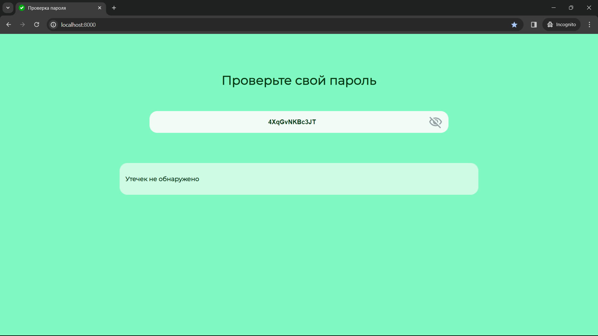
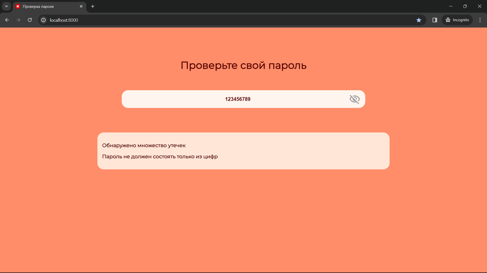

## About

The project implements an autonomous password check service based on data provided by [HaveIBeenPwned](https://haveibeenpwned.com/).  
However, all data is stored by the service, and thus HaveIBeenPwned is only needed during data updates.  
The service performs data updates in the background fully automatically, so no pause or restart is needed.  

This app may be used with a web interface or via API.  
Password leak data updates may be performed with the admin interface or via the admin API.  


## Quick App Launch

Create and activate a virtual Python environment using the following commands:

```commandline
python -m venv venv
source venv/Scripts/activate
```

Install requirements:

```commandline
pip install -r requirements.txt
```

Create a ***.env*** file (more info in ***README.md*** for `devops` package).  

Run the FastAPI app specifying ***.env*** file:

```commandline
uvicorn main:app --reload --env-file .env
```


## Usage

The client web page is located at the relative path "/".  
The admin web page is located at the relative path "/admin".  

API documentation web page is located at the relative path "/docs".  


## Deployment

Deployment steps are described in ***README.md*** for `devops` package.

## Implementation Details

The data from HaveIBeenPwned is stored with storage implemented in the `storage` package (more info there).  
This storage is fully asynchronous, as well as the application made with FastAPI.  


## Demo

Good password  


Weak leaked password  


Admin page  

